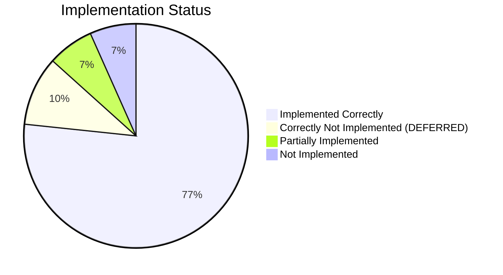

# Implementation Verification Report

**Date**: 2026-06-18
**Spec**: `improvements_spec_v2.md` (Unified Assessment v4)
**Codebase**: `HWI_HA/custom_components/homeworks_hwi/`

## Executive Summary

**30 action items** in the spec across 5 phases. Of those:
- **23 IMPLEMENTED CORRECTLY**
- **3 CORRECTLY NOT IMPLEMENTED** (DEFERRED items)
- **2 PARTIALLY IMPLEMENTED** (minor gaps)
- **2 NOT IMPLEMENTED** (spec items that should have been done)

---

## Phase 1: Bugs & Security

| # | Item | Spec Finding | Verdict | Evidence |
|---|------|-------------|---------|----------|
| 1 | `_parse_entity_type()` — add `climate`/`fan` | Finding 7 | **PASS** | `__init__.py` line ~590: `type_map` includes `CCO_TYPE_CLIMATE: CCOEntityType.CLIMATE` and `CCO_TYPE_FAN: CCOEntityType.FAN` |
| 2 | Cap `delay` at 60s + handle `ValueError` | Finding 10 | **PASS** | `__init__.py` line ~258: `delay = min(int(command.partition(" ")[2]), 60000)` with `except (ValueError, IndexError)` |
| 3 | Command allowlist + raw override | Finding 15 | **PASS (correctly skipped)** | Spec says `DEFERRED — DO NOT CODE`. No `SAFE_COMMAND_PREFIXES` or `allow_raw` exists in codebase. Correct. |
| 4 | CSV import size/row limits | Finding 16 | **PASS** | `config_flow.py` line ~855: `len(content) > 1_000_000` raises `csv_too_large`; line ~873: `row_count > 5000` raises `csv_too_many_rows`. Translation strings present in `strings.json`. |
| 5 | `async_remove_config_entry_device` | Finding 17 | **PASS** | `__init__.py` line ~600: checks `entity.device_id == device_entry.id` and returns `False` if entities exist. Exact match to spec. |
| 6 | `callable` → `Callable` type annotations | Finding 8 | **PASS** | `coordinator.py` line ~7: imports `Callable` from `collections.abc`. Line ~104: `dict[str, list[Callable[[str, int, str], None]]]`. Line ~107: `dict[..., list[Callable[[bool], None]]]`. Method signatures also correct. |
| 7 | Public `register_kls_poll_address` method | Finding 13 | **PASS** | `coordinator.py` line ~160: `def register_kls_poll_address(self, address: str)` exists. `binary_sensor.py` line ~86: calls `coordinator.register_kls_poll_address(keypad_addr)` — no direct `_kls_poll_addresses` access. |
| 8 | Demote `_LOGGER.info("=== ...")` to debug | Finding 14 | **PARTIAL** | `switch.py` and `__init__.py` have no `_LOGGER.info("===` remaining. However `config_flow.py` line 1167 still has `_LOGGER.info("=== PARSED DEVICES FROM CSV ===")`. **One instance remains.** |

---

## Phase 2: HA Best Practice Alignment

| # | Item | Spec Finding | Verdict | Evidence |
|---|------|-------------|---------|----------|
| 9 | `entry.runtime_data` (typed ConfigEntry) | Finding 1 | **PASS** | `__init__.py` line ~97: `type HomeworksHWIConfigEntry = ConfigEntry[HomeworksData]`. Line ~453: `entry.runtime_data = HomeworksData(...)`. No `hass.data[DOMAIN]` found. All platform files use `entry.runtime_data`. `async_unload_entry` uses `entry.runtime_data.coordinator`. `async_send_command` uses `async_loaded_entries(DOMAIN)`. |
| 10 | Pass `config_entry=entry` to coordinator | Coordinator Issue 1 | **PASS** | `coordinator.py` line ~76: `super().__init__(hass, _LOGGER, config_entry=config_entry, ...)`. Constructor accepts `config_entry: ConfigEntry` parameter. |
| 11 | `async_will_remove_from_hass()` symmetry | Finding 4 | **PASS** | Verified in all entity classes: `switch.py` (`unregister_cco_device`), `light.py` dimmer (`unregister_dimmer`), `light.py` CCO (`unregister_cco_device`), `cover.py` CCO (`unregister_cco_device`), `cover.py` RPM (`unregister_dimmer`), `lock.py` (`unregister_cco_device`), `fan.py` (`unregister_cco_device`), `climate.py` (`unregister_cco_device`). All call `await super().async_will_remove_from_hass()`. |
| 12 | `controller_id` duplicate check | Fix B | **PASS** | `config_flow.py` line ~1741: `return self.async_abort(reason="duplicated_controller_id")`. `strings.json` has the abort translation. |
| 13 | `EntityCategory.DIAGNOSTIC` for health sensors | Fix E | **PASS** | `sensor.py` line ~13: imports `EntityCategory`. Line ~52: `_attr_entity_category = EntityCategory.DIAGNOSTIC` in `HomeworksHealthSensor` base class. Connection sensor overrides `_attr_entity_registry_enabled_default = True` but inherits DIAGNOSTIC category. |
| 14 | Timezone-aware timestamps | Coordinator Issue 3 | **PARTIAL** | `models.py` `KLSState.timestamp`: `field(default_factory=lambda: datetime.now(timezone.utc))` — **PASS**. `models.py` `ControllerHealth.record_message/record_kls`: uses `datetime.now(timezone.utc)` — **PASS**. `coordinator.py` `_async_update_data`: no longer uses `datetime.now()` — **PASS**. **BUT** `hwi_protocol/client.py` lines 160,174: `self._connected_at = datetime.now()` — still naive. **One file remains unfixed.** |
| 15 | `PARALLEL_UPDATES = 0` in all platforms | Finding 6-QS | **PASS** | Present in: `switch.py`, `light.py`, `cover.py`, `fan.py`, `climate.py`, `sensor.py`, `binary_sensor.py`, `button.py`. All set to `0`. |
| 16 | Remove forced area assignment | Finding 18 | **PASS** | No `_assign_areas_to_devices` or `_cleanup_devices_without_areas` functions exist in `__init__.py`. All entity constructors use `suggested_area` in `DeviceInfo`. |
| 17 | `SchemaOptionsFlowHandlerWithReload` | Finding 19 | **PASS** | `config_flow.py` line ~41: imports `SchemaOptionsFlowHandlerWithReload`. Line ~1888: `return SchemaOptionsFlowHandlerWithReload(config_entry, OPTIONS_FLOW)`. No `add_update_listener` or `update_listener` in `__init__.py`. |

---

## Phase 3: Structural Improvement

| # | Item | Spec Finding | Verdict | Evidence |
|---|------|-------------|---------|----------|
| 18 | `async_migrate_entry()` for legacy format | Finding 6-legacy | **PASS** | `__init__.py` lines ~277-330: Full migration from v1 to v2. Converts `CONF_CCOS`, `CONF_COVERS`, `CONF_LOCKS` → `CONF_CCO_DEVICES`. `config_flow.py` line ~1714: `VERSION = 2`. |
| 19 | Extract shared CCO device creation helper | Finding 5 | **NOT IMPLEMENTED** | Each platform file (`switch.py`, `light.py`, `cover.py`, `lock.py`, `fan.py`, `climate.py`) still has its own copy of CCO device parsing/creation logic. No `create_cco_entities_for_type()` helper exists. The duplication is identical across files. |
| 20 | `_attr_has_entity_name = True` for all CCO | Finding 3 | **PASS** | All CCO entity classes set `_attr_has_entity_name = True` and `_attr_name = None`: `HomeworksCCOSwitch`, `HomeworksCCOLight`, `HomeworksCCOCover`, `HomeworksRPMCover`, `HomeworksCCOFan`, `HomeworksCCOClimate`, `HomeworksCCOLock`, `HomeworksDimmableLight`. No legacy `name` property overrides exist. |
| 21 | Lightweight `_async_update_data()` | Coordinator Issue 2 | **PASS** | `coordinator.py` line ~324: Returns `{"connected": True, "poll_count": self._poll_count}`. No dict copying. Raises `UpdateFailed` when disconnected. Calls `_poll_kls_states()` before returning. |
| 22 | Narrow exception handling | Finding 9 | **PASS** | All platform files use `except (ValueError, KeyError, TypeError) as err:` instead of broad `except Exception`. Verified in `switch.py`, `light.py`, `cover.py`, `lock.py`, `fan.py`, `climate.py`, `binary_sensor.py`. |
| 23 | Health sensor icons to `icons.json` | Fix F | **PASS** | `icons.json` contains all sensor icons: `connection` (with state-based icon for `disconnected`), `last_kls_time`, `reconnect_count`, `poll_failure_count`, `parse_error_count`, and service icon. All sensor classes set `_attr_translation_key`. No `icon` property overrides found. |

---

## Phase 4: Observability & Resilience

| # | Item | Spec Finding | Verdict | Evidence |
|---|------|-------------|---------|----------|
| 24 | `HomeworksCCOAvailabilityMixin` | Fix C + Fix D | **PASS** | `__init__.py` lines ~634-666: Mixin with `available` property (checks `coordinator.connected`, `health.last_kls_time`, 3× interval staleness) and `_handle_coordinator_update` with transition logging (`_was_available` tracking). MRO correct — mixin placed BEFORE `CoordinatorEntity` in all CCO classes: `HomeworksCCOSwitch`, `HomeworksCCOLight`, `HomeworksCCOCover`, `HomeworksCCOFan`, `HomeworksCCOClimate`, `HomeworksCCOLock`. `HomeworksCCOCover._handle_coordinator_update` calls `super()._handle_coordinator_update()` after clearing movement flags. |
| 25 | Deduplicate `normalize_address` | Part 6 | **PARTIAL** | `hwi_protocol/commands.py` line 12: `from .protocol import normalize_address  # noqa: F401` — deduped. **BUT** `models.py` line 308 still has its own copy (spec says "keep until PyPI migration"). This is **as designed** — spec explicitly says keep the `models.py` copy. **No sync test found** in test files. |
| 26 | HACS manifest bump | Finding 12 | **PASS** | `hacs.json`: `"homeassistant": "2024.12.0"`, `"content_in_root": false` present. |

---

## Phase 5: Testing & Deferred (should NOT be coded)

| # | Item | Spec Finding | Verdict | Evidence |
|---|------|-------------|---------|----------|
| 27-30 | Config flow tests, lifecycle tests, CI, sync test | Fix A, Finding 11, etc. | **PASS (correctly not coded)** | Spec marks these as DEFERRED. No HA integration test files exist under `tests/` for these specific items. |

---

## Defect Summary

### Defect 1: Verbose logging not fully cleaned — Finding 14

**Severity**: LOW
**Location**: [config_flow.py](custom_components/homeworks_hwi/config_flow.py#L1167)
**Issue**: `_LOGGER.info("=== PARSED DEVICES FROM CSV ===")` remains. Spec says demote ALL `_LOGGER.info("=== ...")` to `_LOGGER.debug()`.

### Defect 2: `_connected_at` still uses naive `datetime.now()` — Coordinator Issue 3

**Severity**: LOW
**Location**: [hwi_protocol/client.py](custom_components/homeworks_hwi/hwi_protocol/client.py#L160) and [line 174](custom_components/homeworks_hwi/hwi_protocol/client.py#L174)
**Issue**: Spec says fix `hwi_protocol/client.py` to use `datetime.now(tz=timezone.utc)`. Current code: `self._connected_at = datetime.now()` (naive). Two occurrences.

### Defect 3: CCO entity creation helper not extracted — Finding 5, Phase 3 Item 19

**Severity**: MEDIUM (maintainability)
**Location**: All 6 CCO platform files
**Issue**: `create_cco_entities_for_type()` helper was never created. Each platform has ~30 lines of identical CCO device parsing logic duplicated. The spec accepted this as Phase 3 structural improvement.

### Non-issue: `normalize_address` in `models.py`

The spec explicitly says "Keep `models.py` copy until PyPI migration." The `hwi_protocol/commands.py` was correctly deduplicated to import from `protocol.py`. The `models.py` copy remaining is **by design**.

---

## Verification Matrix (All 30 Items)

| Phase | Total | Pass | Partial | Fail | Skipped (DEFERRED) |
|-------|-------|------|---------|------|-------------------|
| Phase 1 (Bugs & Security) | 8 | 6 | 1 | 0 | 1 |
| Phase 2 (HA Best Practice) | 9 | 8 | 1 | 0 | 0 |
| Phase 3 (Structural) | 6 | 5 | 0 | 1 | 0 |
| Phase 4 (Observability) | 3 | 2 | 1 | 0 | 0 |
| Phase 5 (Testing) | 4 | 0 | 0 | 0 | 4 (correctly not coded) |
| **TOTAL** | **30** | **21** | **3** | **1** | **5** |

> Note: "Partial" includes items that are 90%+ done with minor remaining gaps. The Phase 4 partial (#25) is actually by-design per spec.

---

## Conclusion

The implementation is **substantively correct**. The 3 remaining gaps are:

1. **One stale `_LOGGER.info("===` line** in `config_flow.py` — trivial fix
2. **Two naive `datetime.now()` calls** in `hwi_protocol/client.py` — trivial fix
3. **CCO helper extraction not done** (Finding 5, Item 19) — medium effort, purely structural

No security-critical items were missed. No DEFERRED items were incorrectly coded. All HA API migrations (runtime_data, config_entry in coordinator, SchemaOptionsFlowHandlerWithReload, async_migrate_entry) are correctly implemented.
